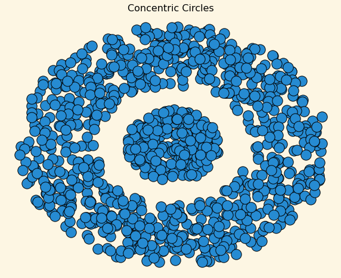

# K-Means vs. Spectral Clustering

Clustering, a type of unsupervised learning, is used to capture the structure, grouping, and underlying processes immanent in a dataset. The goal of clustering is to separate the data into distinct groups in such a way that data points in the same groups are more similar to each other than data points in other groups. Here, we explore two different clustering algorithms, K-means and spectral clustering, to get an insight into how they work and compare their performance on data in a two-dimensional space. 

### The Data

The dataset contains 1125 rows and 3 columns: 'Idx', 'x', and 'y'. Each row represents a data point, and the columns represent the index and x-y coordinate locations of each data point, respectively. The first ten columns of the dataset and a scatterplot of the data are shown below

|Idx   |x                  |y                   |
|------|-------------------|--------------------|
|1     |-1.06519785476848  |2.41602231329307    |
|2     |0.20061166305095   |0.0508693247102201  |
|3     |-2.15951012307778  |-0.225542888045311  |
|4     |-0.643773137591779 |2.18496798584238    |
|5     |-0.975246698129922 |-0.702547463122755  |
|6     |-0.911281818989664 |0.637968627735972   |
|7     |0.321858583018184  |-1.01905076019466   |
|8     |-1.08197453571483  |2.64709240570664    |
|9     |1.22096595587209   |2.0513566522859     |
|10    |-2.30543425306678  |1.45974390394986    |

### K-means Clustering

Given *n* data points, the objective is to divide them into *K* groups such that:
- data points in a group are very similar to eachother
- data points in two different groups are less similar

But how do we define similarity? K-means uses the Euclidean distance between two points as the default distance metric for clustering. 

We are given a training set $\{(x,y)^{(1)},(x,y)^{(2)},\dots,(x,y)^{(m)}\}$ where $(x,y)^{(i)}\in \mathbb{R}^n$. These are the training samples. The output should be a vector **c** of cluster assignment for each sample and K mean vectors $\mu$.

The **K-means loss function** is given by: \
$$\sum_{k}\sum_{i\in  C_{k}}\left|\left|x_i-\mu _k \right| \right|^2$$

We can see that this is a non-convex function, which means that we cannot find the global optimal $\mu$ and **c**. The algorithm will converge to a local optima. In order to optimize, we use the **Coordinate Descent Algorithm**. The loss function is: 

$$\mathcal{L} = \sum\limits_{i=1}^m\sum\limits_{k=1}^K \mathbb{1}\{c_i=k\} \lvert\lvert x_i-\mu_k\rvert\rvert^2$$

Although we cannot find the best $\mu$ and **c** simultaneously, we can:

(1) find the best **c** given a fixed $\mu$.
$$c^i = \arg\min_j\lvert\lvert x^i - \mu_j\rvert\rvert^2$$

(2) find the best $\mu$ given a fixed **c**. 
$$\mu_k = \frac{1}{n_k} \sum\limits_{i=1}^m x_i\mathbb{1}[c_i=k]$$

The formal algorithm is as follows:

Given a set of points $S = \left( s_1, ... s_n \right)$ in $\mathbb{R}^l$ that we want to cluster into *k* subsets

1. Initialize **cluster centroids** $\mu_1,\mu_2,\dots,\mu_k\in \mathbb{R}^n$ randomly.

2. For each i, set $c^i = \arg\min_j\lvert\lvert x^i - \mu_j\rvert\rvert^2$.

3. For each j, set $\mu_j = \frac{\sum_{i=1}^m\mathbb{1}[c^i=j]x^i}{\sum_{i=1}^m\mathbb{1}[c^i=j]}$.

4. Repeat steps 2 and 3 until convergence.

  
  
  

### Spectral Clustering

Another popular technique used for partitioning data into clusters based on their underlying structure is **Spectral Clustering**. It's particularly effective for handling datasets where the data points are not easily separable in the original feature space but might exhibit clear patterns or clusters when analyzed in a different space. The data is transformed into a new representation using  eigenvectors of a **Similarity** or **Affinity** matrix derived from the distance between points, and then a standard clustering algorithm like K-means is applied to the reduced-dimensional data to partition it into clusters.

The formal algorithm is as follows:

Given a set of points $S = \left( s_1, ... s_n \right)$ in $\mathbb{R}^l$ that we want to cluster into *k* subsets

1. Form the affinity matrix $A \in \mathbb{R}^{n*n}$ defined by $A_{ij} =  exp(-\left|\left| s_i - s_j\right|\right|^2/2\sigma^2)$ if $i \neq j$ and $A_{ii} = 0$. 

2. Define *D* to be the diagonal matrix whose (i, i)-element is the sum of A's i-th row, and construct the Laplacian matrix $L = D^{-1/2}AD^{-1/2}$.

3. Find $x_1, x_2, ... x_k$, the largest *k* eigenvectors of *L* and form the matrix $X = \left [x_1, x_2, ... x_k  \right ] \in \mathbb{R}^{n*k}$ by stacking the eigenvectors in columns.

4. Form the matrix *Y* from *X* by renormalizing each of *X*'s rows to have unit length (length 1). 

5. Treating each row of *Y* as a point in *K* dimensions $\left ( \mathbb{R}^k \right )$, cluster them into *k* clusters via K-means.

  

